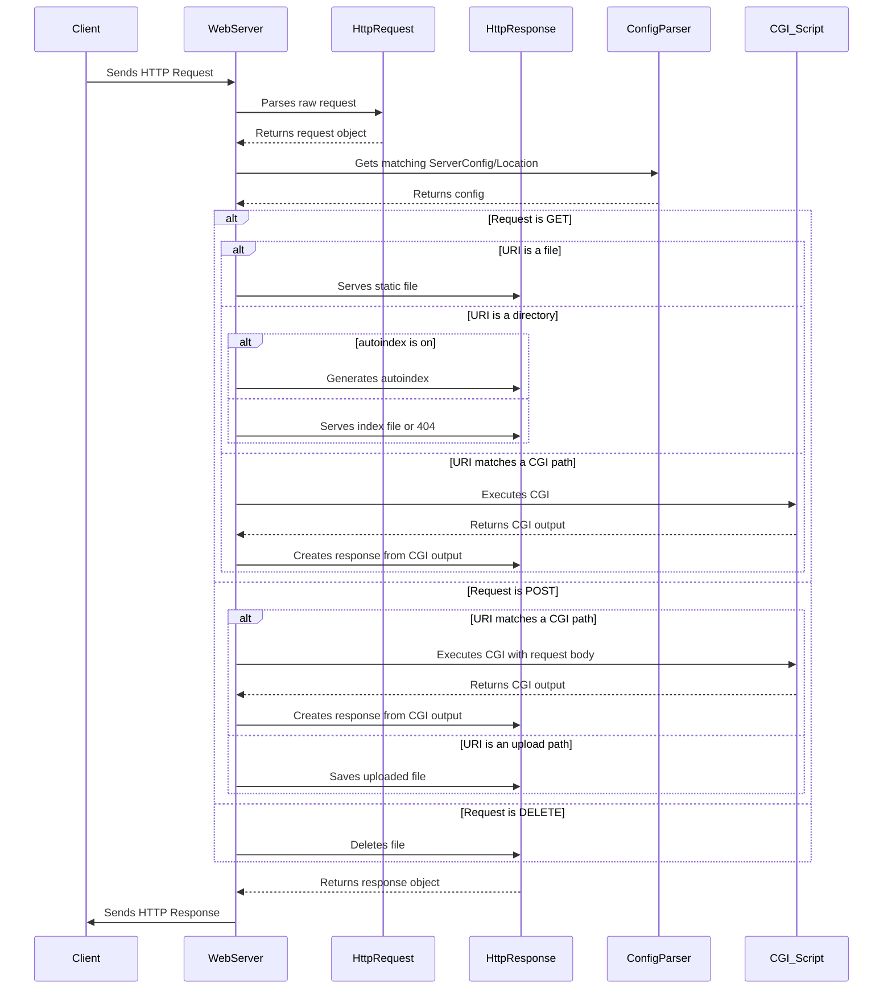

# Webserv

A simple, event-driven HTTP web server written in C++98. This project is designed to handle basic HTTP requests (GET, POST, DELETE) and serve static files, handle CGI scripts, and manage file uploads and deletions.

## Features

*   **HTTP/1.1 Compliant**: Handles GET, POST, and DELETE requests.
*   **Configuration File**: Uses a custom configuration file similar to Nginx to define server behavior.
*   **Multi-client Handling**: Uses `poll()` to efficiently manage multiple client connections simultaneously.
*   **Static File Serving**: Serves static files from a specified document root.
*   **Autoindexing**: Automatically generates a directory listing if a requested directory does not have an index file.
*   **CGI Execution**: Supports CGI scripts (e.g., PHP) for dynamic content generation.
*   **File Uploads**: Handles file uploads via POST requests.
*   **File Deletion**: Deletes files via DELETE requests.
*   **Custom Error Pages**: Allows for the configuration of custom error pages.
*   **Virtual Servers**: Can host multiple "virtual" servers on different ports or with different server names.

## Building and Running

### Building

To build the server, simply run `make`:

```bash
make
```

This will compile the source files and create the `webserv` executable in the project's root directory.

### Running

To run the server, you need to provide a configuration file as an argument:

```bash
./webserv webserv.conf
```

The server will then start and listen for incoming connections on the ports specified in the configuration file.

## Configuration

The server is configured using a file that is a simplified version of an Nginx configuration file. The default configuration file is `webserv.conf`.

Here is an example of a server block:

```nginx
server {
    listen 8080;
    server_name example.com;
    root /path/to/www;
    client_max_body_size 10M;

    error_page 404 /path/to/404.html;

    location / {
        allowed_methods GET;
        autoindex on;
        index index.html;
    }

    location /uploads {
        allowed_methods POST DELETE;
        root /path/to/uploads;
    }

    location /cgi-bin {
        allowed_methods GET POST;
        cgi_path .php /path/to/php-cgi;
    }
}
```

## Project Structure

The project is divided into the following main components:

*   **`WebServer`**: The core class that manages the server. It listens for incoming connections, handles requests, and sends responses. It uses `poll` to handle multiple clients simultaneously.
*   **`ServerConfig`**: Holds the configuration for a single `server` block from the configuration file. This includes the port, server names, error pages, and client body size limits.
*   **`Location`**: Holds the configuration for a `location` block within a `server` block. This defines how requests for specific URIs are handled, including allowed methods, the document root, and CGI paths.
*   **`ConfigParser`**: Parses the `webserv.conf` file and creates a vector of `ServerConfig` objects.
*   **`HttpRequest`**: Represents an HTTP request. It parses the raw request string and provides methods to access the method, URI, headers, and body.
*   **`HttpResponse`**: Represents an HTTP response. It provides methods to set the status code, headers, and body, and then serializes the response to a string.

## Request Handling Flow

Here is a sequence diagram that illustrates how the server handles an HTTP request:


